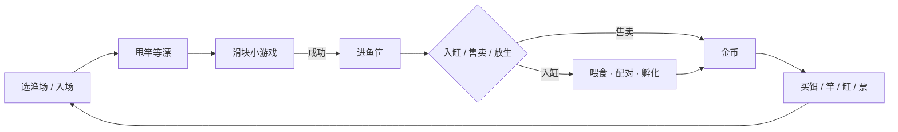

# 钓鱼佬日常 · 一页设计说明

休闲钓鱼 + 水族馆养成。核心承诺：免费玩家能走完整循环；付费买的是时间和便利，不是更强的数值。

本 Demo：本地可玩垂直切片。16 鱼、2 渔场（乡村池塘 / 清溪）。养成按北京自然日结算。

## 核心循环

挂机是同一条产鱼线：自动出鱼进筐，但必须同时有**鱼饵**和**能量**。自己甩杆只扣饵、不扣能量。

后期钓鱼线和育卵线并行：钓换爆发和种类；养换稳定日产。新种只能野外钓到或鱼行买到。

## 付费原则

1. **同品质金币通道与珍珠通道数值持平。** 珍珠竿不比金币竿更强。珍珠换时间，不换战力。
2. **汇率写死：** 1 珍珠 = 1 元 = 100 金币。月卡买每日金币和便利，不买碾压。
3. **加速只绑工期。** 扩建、孵化用金币开工；珍珠或广告只缩短等待。
4. **核心玩法走金币。** 渔场办卡 / 买票 / 潜入都不收珍珠。高档场可以很贵，但不锁在充值后面。
5. **变现三件套：** 月卡、礼包（装备/服装/鱼缸）、加速。礼包给「刚好跳一档」的体验，不把成长曲线买断。

## 五条取舍

这五条是产品骨架，不是实现细节。每一条都否决过更常见的做法。

**1. 付费买时间，不买更强的竿。**  
否决「珍珠竿数值更高」。否则金币线会在买第一根好竿之后停转，免费玩家被 steeper 的战力墙劝退。同品质两通道只是获取方式不同。

**2. 鱼饵和鱼食拆成两种消耗品。**  
否决「一种饵既能钓又能喂」。出钓每次下竿扣 1 个鱼饵；缸里每条鱼每天扣 1 份同品质鱼食。两套库存、两套货架，循环才分得出「去钓」和「在养」。

**3. 手动钓鱼不扣能量；挂机必须饵和能量都够。**  
否决「体力当万能闸」和「挂机只扣体力、饵形同虚设」。自己玩要的是手感，只扣饵；挂机是日预算，双闸门停机。能量饮料随时能喝但贵；菜便宜但有饱腹次数和间隔。

**4. 小游戏难度只跟鱼品质走；饵和欧气只改上钩。**  
否决把所有加成叠进滑块。品质越高，鱼滑块越小、越快、越不规则；装备抵的是这条难度。鱼饵品质、欧气只影响「会不会上钩、更偏哪种鱼」。稀缺感来自概率和手感，不来自属性膨胀。

**5. Demo 验证循环，不验证图鉴量。**  
否决「62 鱼一次做完」和「1 分钟 = 1 游戏天」。图鉴 16 鱼、2 个完整渔场足够看框架；喂食、孕期、孵化、月卡跟真实日期对齐，加速才有东西可卖。时间压缩会把付费点演示成假的。

---

现场演示只走：水族馆 → 出钓甩竿上钩 → 鱼进筐 → 存进缸。配对、潜入、鱼行口头带过即可。
